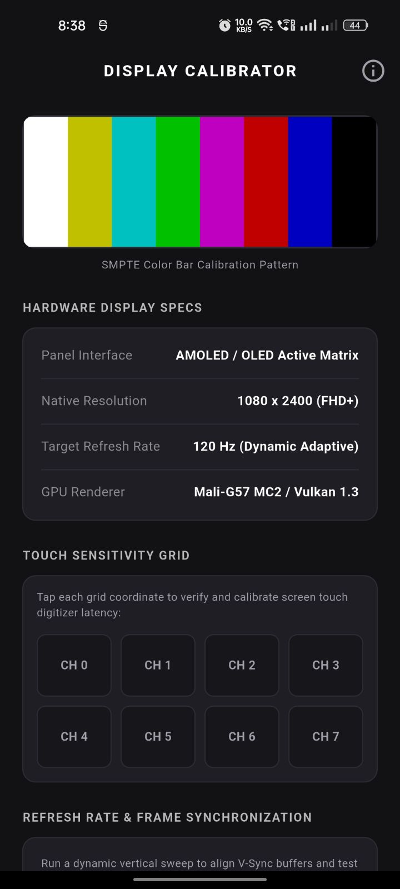
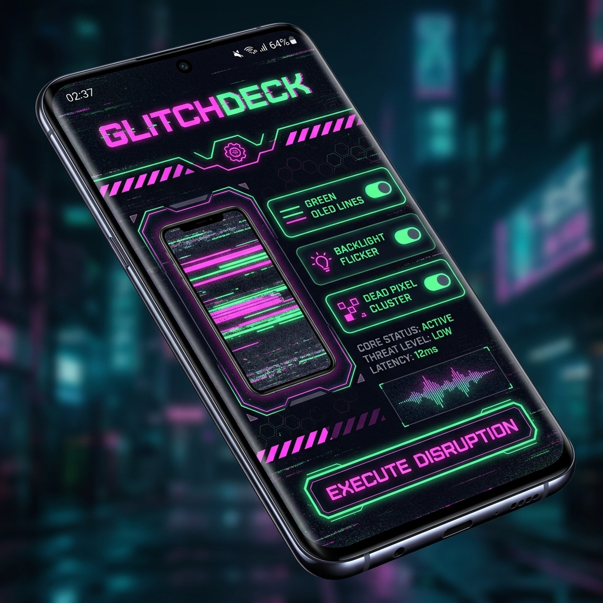
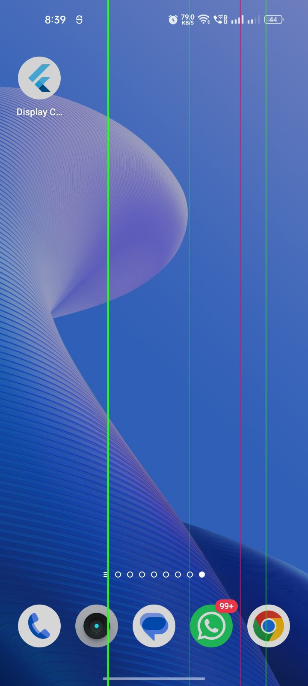

# Display Calibrator // GLITCHDECK

A high-fidelity screen utility and stealth prank application built with Flutter.

---

## 📱 The Concept

At first glance, **Display Calibrator** is a highly convincing, professional screen diagnostic utility. It includes:
* **SMPTE Color Bar Calibration Pattern**
* **Touch Sensitivity Grid Latency Calibrator** (interactive coordinates `CH 0` to `CH 7` with selection haptics)
* **Refresh Rate & V-Sync Stress Test** (animated sweep-line simulation)

### 🤫 The Stealth Console
Tapping the **"DISPLAY CALIBRATOR"** title bar **5 times consecutively** unlocks the secret **GLITCHDECK**—a cyberpunk-themed glitch protocol dashboard. 

From **GLITCHDECK**, you can configure and execute high-fidelity visual overlays to prank users by simulating a severely damaged display.

---

## 🛠️ Key Features & Glitch Payloads

### 1. Payload Configurators
* **Green OLED Lines**: Constant, bright vertical neon-green and magenta line bleeding (identical to physically fractured AMOLED matrices).
* **Backlight Flicker**: High-frequency brightness sweeps and horizontal wave signal disruptions.
* **Dead Pixel Cluster**: Microscopic twinkling stuck subpixels (red, green, blue) scattered across the screen.

### 2. Launch Controls
* **Standard Draw Mode**: Standard "Draw over other apps" system overlay.
* **Advanced Accessibility Mode**: Accessibility service rendering overlay that works even over the lock screen and system notifications.
* **Delay Options**: Instant execution or timer delays (`3s`, `5s`, `10s`, `20s`, `30s`) to stage and set down the target device.

### 3. Safety & Dismissal Mechanisms
* **Stealth Dismissal**: Triple-tapping in the top-right corner (approx. 88% width, 6% height) of the active overlay immediately dismisses standard mode overlays.
* **Direct Abort**: Cancel any pending delay launch directly from the countdown dashboard.
* **System Notification & Dashboard Control**: Instantly dismiss running pranks via the dashboard button.

---

## 📸 Screenshots

| 🔍 1. Decoy Screen (Standby) | 🎛️ 2. GlitchDeck Control Panel | ⚡ 3. Active Disruption Overlay |
| :---: | :---: | :---: |
|  |  |  |

---

## 🎬 Video Demonstration

<video src="assets/demo.mp4" width="320" controls></video>

### Demo Flow:
1. **Calibration Test**: Open the app. Run the touch grid test and start the sweep stress test.
2. **Stealth Unlock**: Tap the title **5 times** to trigger physical haptic vibrations and slide open **GLITCHDECK**.
3. **Payload Configuration**: Toggle green lines and dead pixels on or off. Select **3 Seconds Delay**.
4. **Execution**: Press **EXECUTE DISRUPTION**. The app returns to normal mode, and countdown begins.
5. **Prank Mode Active**: The screen suddenly starts flickering and showing hardware OLED failure lines.
6. **Dismissal**: Secretly triple-tap the top-right corner to exit the screen back to normal instantly.

---

## 📦 APK Installation & Testing

You can install the pre-compiled **Release APK** to test directly on your physical Android device.

### Download APK:
The production build is located in:
📂 `build/app/outputs/flutter-apk/app-release.apk`

*Note: Android will prompt you to grant either the **Draw over other apps** (Display over other apps) permission or the **Accessibility Service** permission under Accessibility Settings depending on whether you run Standard or Advanced mode.*

---

## 🚀 Getting Started for Developers

### Prerequisites
* Flutter SDK (v3.22.0 or higher recommended)
* Android SDK (API 21+)

### Installation & Run
1. Clone this repository and navigate to the project directory:
   ```bash
   cd screen_prank_app
   ```
2. Fetch package dependencies:
   ```bash
   flutter pub get
   ```
3. Run the static analyzer to confirm warning-free code:
   ```bash
   flutter analyze lib test
   ```
4. Run the unit & widget test suites:
   ```bash
   flutter test
   ```
5. Deploy to a connected physical device:
   ```bash
   flutter run --release
   ```

---

## 🧬 Architecture Overview

* **`lib/main.dart`**: Sets up entry points for both the background service `overlayMain()` (transparent execution thread) and the primary app `main()`.
* **`lib/decoy_screen.dart`**: The standard-looking diagnostic layout with interactive gesture detection.
* **`lib/dashboard.dart`**: The GlitchDeck cyberpunk UI panel containing the option selectors, dropdown delays, haptics, and MethodChannel bridges.
* **`lib/overlay_widget.dart`**: Contains the CustomPainters (`ScanLinePainter`, `GlitchLinePainter`, `DeadPixelsPainter`) that draw pixel-perfect software damage on the system overlay canvas.
